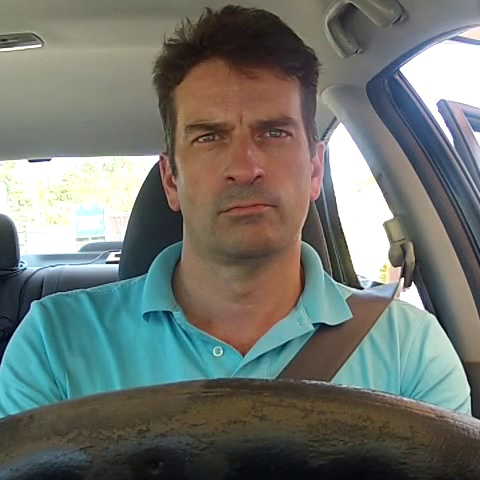
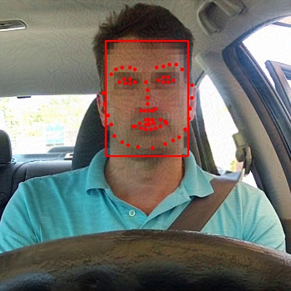
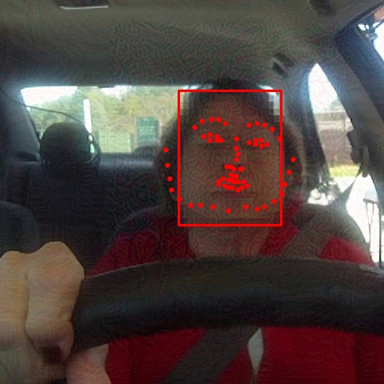
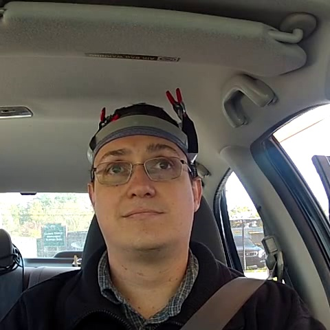
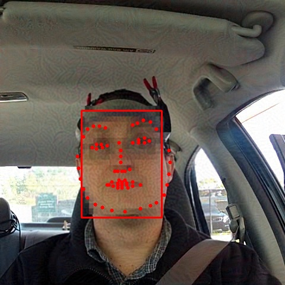
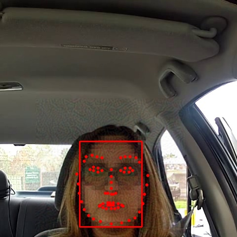

# Driving Road Safety Forward: Video Data Privacy

## Example use cases
### Non-targeted attack

- Attack on batch
```python
from attack.deid import Pixelate
from models.face_align.fan import FANAlignment
from models.face_det.retinaface import RetinaFaceDetector
from attack.attacker import FaceAttacker, LandmarkAttacker, generate_tensors

# Init models, attackers
align_model = FANAlignment()
det_model = RetinaFaceDetector()
det_attacker = FaceAttacker(optim='I-FGSM')
lm_attacker = LandmarkAttacker(optim='I-FGSM')
deid_fn = Pixelate(20)

def doit(batch):
    """
    Attack batch of images on detection and alignment models
    :params: 
        batch: list of cv2 image
    :return: list of adversarial images
    """
    # Generate truth bboxes
    det_norm = det_model.preprocess(batch)
    det_norm = generate_tensors(det_norm)
    det_results = det_model.detect(det_norm)
    face_boxes = det_model.get_face_boxes(det_results)

    # Generate deid images
    adv_images = deid_fn.forward_batch(batch, face_boxes)

    # Stage one, attack detection

    adv_det_imgs = det_attacker.attack(
        victim = det_model,
        images = batch,
        deid_images = adv_images
    )

    # Predict face bboxes on adversarial images
    adv_det_norm = det_model.preprocess(adv_det_imgs)
    adv_det_norm = generate_tensors(adv_det_norm)
    adv_det_results = det_model.detect(adv_det_norm)
    adv_face_boxes = det_model.get_face_boxes(adv_det_results)

    # Check if a box is empty, if so, use previous box or next box
    for idx, box in enumerate(adv_face_boxes):
        if len(box) == 0:
           adv_face_boxes[idx] = adv_face_boxes[idx-1]

    # Stage two, attack alignment
    # Attack alignment model using adversarial images from above
    # Use original images to generate ground truths

    adv_lm_imgs = lm_attacker.attack(
        victim = align_model,
        images = batch,
        deid_images = adv_det_imgs,
        face_boxes = adv_face_boxes
    )

    return adv_lm_imgs
```

| Original images | Predictions before deid | Predictions after deid |
|:-------------------------:|:-------------------------:|:-------------------------:|
| |  |  |
| |  |  |
| |  |  |
| |  |  |


## Colab Notebooks
- Pixelate Landmarks [](https://colab.research.google.com/drive/1nhtWSODf3UD7ptKLLzneAbE9MtRq-q-7?usp=sharing)
- Adversarial Attack [](https://colab.research.google.com/drive/1BXiBrxdfAK2JEW2uU7ZshKLPbD4ZSXXb?usp=sharing)

## Code References
- https://github.com/timesler/facenet-pytorch
- https://github.com/1adrianb/face-alignment
- https://github.com/hysts/pytorch_mpiigaze
- https://github.com/git-disl/TOG
- https://github.com/honguyenhaituan/PrivacyPreservingFaceRecognition

## Paper References

- https://github.com/brighter-ai/awesome-privacy-papers

```
@inproceedings{letournel2015face,
  title={Face de-identification with expressions preservation},
  author={Letournel, Geoffrey and Bugeau, Aur{\'e}lie and Ta, V-T and Domenger, J-P},
  booktitle={2015 IEEE International Conference on Image Processing (ICIP)},
  pages={4366--4370},
  year={2015},
  organization={IEEE}
}
```
