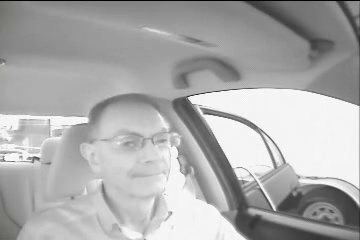
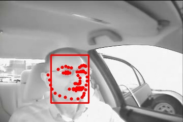
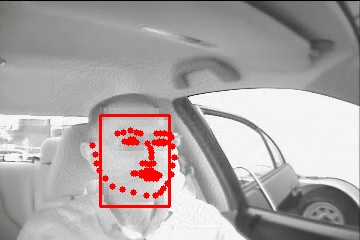

# Driving Road Safety Forward: Video Data Privacy

The goal of this project is to explore adversarial methods for obscuring driver identity in driver-facing video recordings while preserving human behavioral information.


|                       Original images                        |                   Predictions before deid                    |                    Predictions after deid                     |
| :----------------------------------------------------------: | :----------------------------------------------------------: | :-----------------------------------------------------------: |
|   |   |   |
|  |  |  |
|  |  |  |
|  |  |  |
|  |  |  |


## De-identification Attack

- To de-identify video with adversarial attack, run
```
PYTHONPATH=.    python tools/deid.py  -i <input_video> \
                                        -o <output_video> \
                                        -d [retinaface, mtcnn] \                 # Victim detector
                                        -a [fan] \                               # Victim alignment
                                        -z [MPIIFaceGaze, ETH-XGaze] \           # Victim gaze estimator
                                        -g [rmsprop, i-fgsm, mi-fgsm, ...] \     # Attack method
                                        -m [pixelate_30, blur_30] \              # Deid method with level
                                        -bs 16                                   # Batch size
```

## Evaluation

- Compare two videos based on its face bboxes IOU, facial landmarks euclide distance, gaze vectors cosine angle, ...

- First, we inference a video and outputs a JSON file contains predictions.
```
PYTHONPATH=.    python tools/inference.py   -i <input_video> \
                                            -d [retinaface, mtcnn] \
                                            -a [fan] \
                                            -z [MPIIFaceGaze, ETH-XGaze]
```

- Then, we evaluate it with the ground truth JSON.
```
PYTHONPATH=.    python tools/eval_json.py   --json_gt <ground truth json> \
                                            --pred_gt <prediction json> 
```

## Visualization

- To inference detection and estimation models on video, run

```
PYTHONPATH=.    python tools/visualize.py   -i <input_video> \
                                            -o <output_video> \
                                            -d [retinaface, mtcnn] \
                                            -a [fan] \
                                            -z [MPIIFaceGaze, ETH-XGaze]
```

## Colab Notebooks

- Adversarial Attack [](https://colab.research.google.com/drive/1BXiBrxdfAK2JEW2uU7ZshKLPbD4ZSXXb?usp=sharing)

## Code References

- https://github.com/biubug6/Pytorch_Retinaface
- https://github.com/timesler/facenet-pytorch
- https://github.com/1adrianb/face-alignment
- https://github.com/hysts/pytorch_mpiigaze
- https://github.com/git-disl/TOG
- https://github.com/honguyenhaituan/PrivacyPreservingFaceRecognition

## Paper References

- https://github.com/brighter-ai/awesome-privacy-papers
