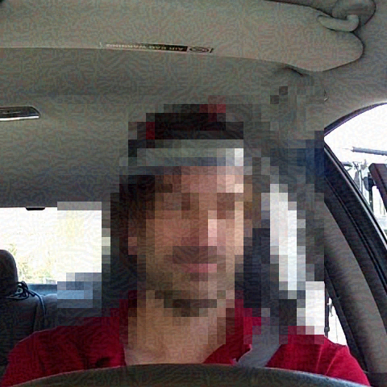
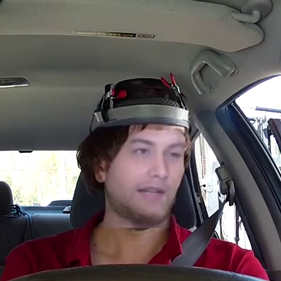

# **MediaEval 2021 - Driving Road Safety Forward: Video Data Privacy** 
# **Facial Data De-identification with Adversarial Generation and Perturbation Methods**

## ***Task Overview***
- [MEDIAEVAL21](./MEDIAEVAL21.md)

## ***Data Overview***
- [DATA](./DATA.md)

## ***Method Overview***

- Run 01: [FaceSwap](./face-swap) 
    - Try swapping the face to fully hide the true identity of the drivers while preserving other information, such as facial expressions, behaviours, etc.
- Run 02: [Adversarial Attack](./adversarial-attack)
    - While preventing and limiting unauthorized models from accessing and exploiting information of the de-identified data. The authorized model can access all information of the de-identified data. 

|  Original image | Adversarial Pertubation | FaceSwap |
| :----------------------------------------------------------: | :----------------------------------------------------------: | :-----------------------------------------------------------: |
|   |   |   |

## ***Working note***
- Our team's working note: [HCMUS at MediaEval 2021: Facial Data De-identification with
Adversarial Generation and Perturbation Methods](./assets/_Driving_Road_MediaEval___2021___HCMUS_.pdf)
