# **RUN 02: Adversarial Attack**


## **Description**
The goal of this project is to explore adversarial methods for obscuring driver identity in driver-facing video recordings while maintaining visible human behavioural information. In this task, we aim to preserve 3 main facial attributes: the bounding box of a face, the facial landmarks, and the gaze vector. 

We would like to summarize the main properties of our method as follows:
1. For human vision, our method can protect the true identity of the person in a video by pixelating or blurring out his/her face.
2. For a specific set of methods (and model weights), our generated videos can reveal hidden attributes that we already successfully embedded into the videos, i.e. the bounding box of a face, the facial landmarks, and the gaze vector. We want to minimize the difference between the extracted attributes before and after our attack.
3. For non-authorized methods (or incompatible weights), we expect that the methods may not accurately exploit much useful information that we already embedded into the videos. 

-------------------------------------------------------
### ***De-identification***
- We provide 2 ways to de-identify an image - Pixelate and Blur, these methods are combined with bounding box to hide the visible face in the image.

|                       Original image                        |                    Pixelate_30                               |                    Blur_100                               |
| :----------------------------------------------------------: | :----------------------------------------------------------: | :-----------------------------------------------------------: |
|   |   | 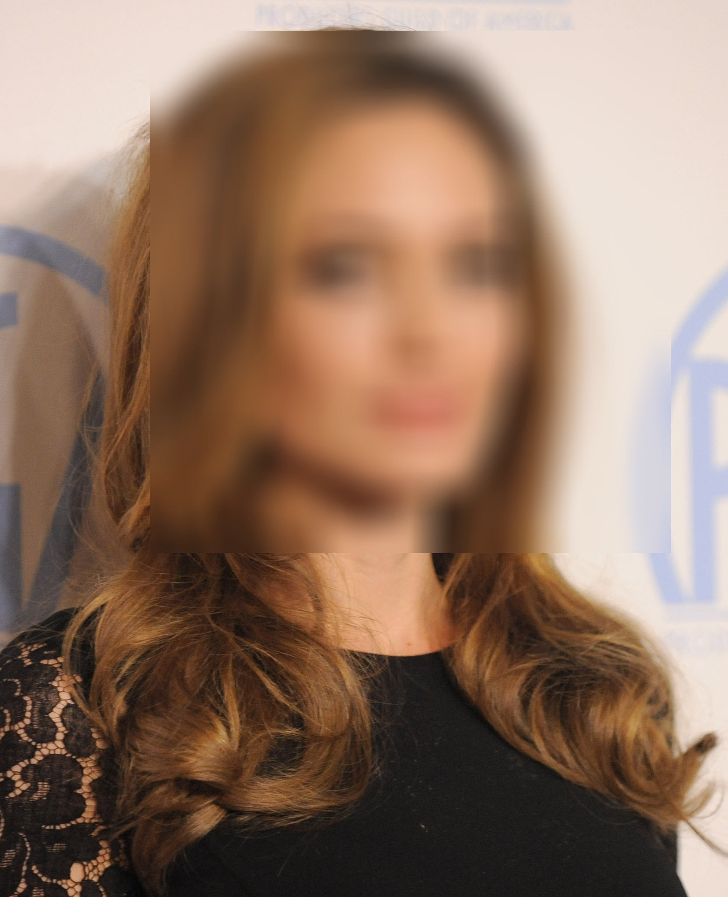  |

-------------------------------------------------------
### ***Iterative Fast Gradient Sign Method (I-FGSM)***

- We apply traditional and improved I-FGSM methods to add pertubation into image.

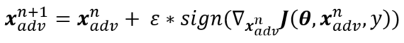

-------------------------------------------------------
### ***Adversarial attack***

- We perform full attack on multiple victim targeted models at the same time and visualize the predictions on the generated images.

|                       Original images                        |                   Predictions before deid[^1]                  |                   De-identified[^2] images                      |                    Predictions after deid[^1]                |                    Predictions after deid+attack[^1]         |
| :----------------------------------------------------------: | :----------------------------------------------------------: | :-----------------------------------------------------------: | :-----------------------------------------------------------: | :-----------------------------------------------------------: |
| 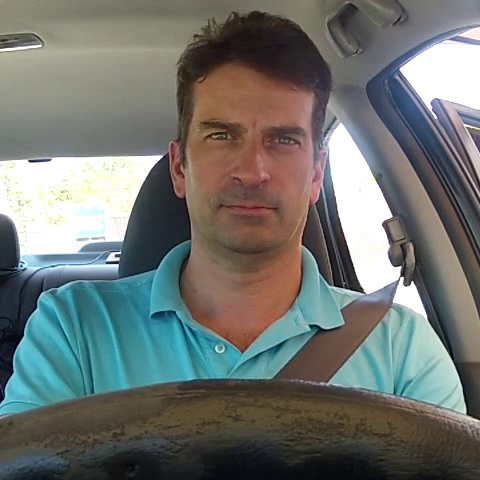  |   |   | 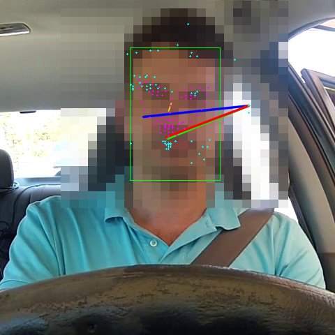| 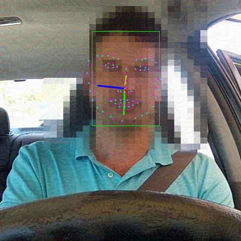  |
|   | 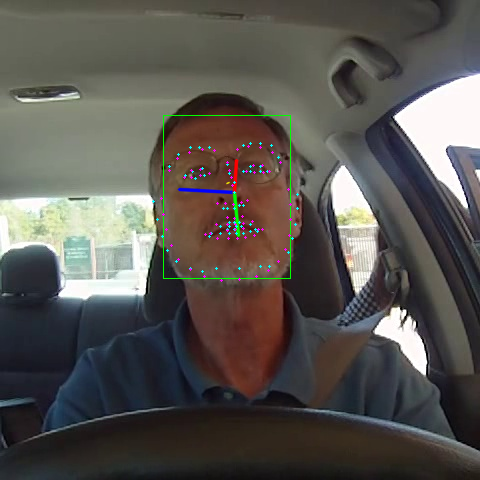  | 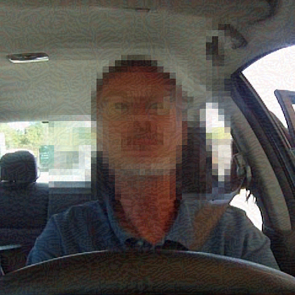  | 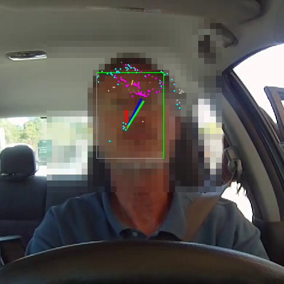| 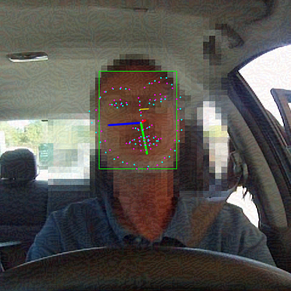  |
|   | 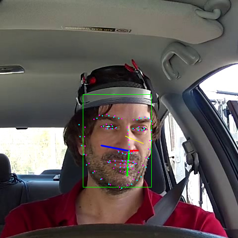  | 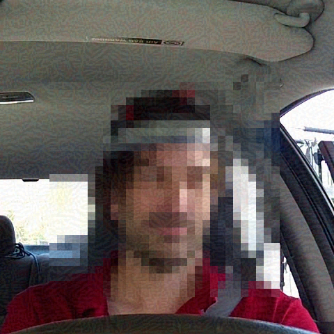  | 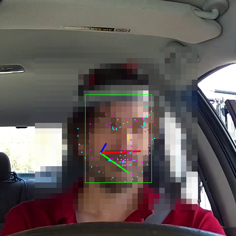|   |
|   | 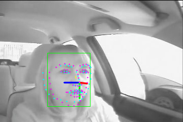  | 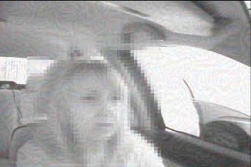  | 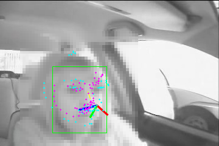| 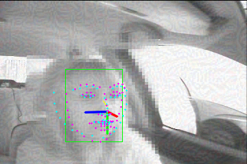  |
|   |   |   | 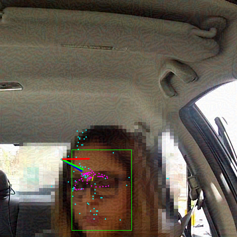| 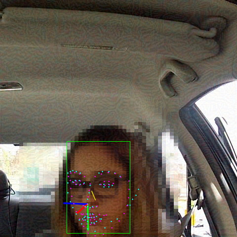  |

The figure above shows the adversarial attack results on de-identified images. Although the faces in the de-identification stage are perturbated to make it difficult for recognizing the identity of the driver, their facial attributes are still preserved successfully after attacked.

[^1]: In this example, the victim models are RetinaFace, FAN Alignment and ETH-XGaze

[^2]: Pixelate as de-identification method


## **How to run**

### ***De-identification Attack***
- To de-identify video with adversarial attack, run
```
PYTHONPATH=.    python tools/deid.py  -i <input_video> \
                                        -o <output_video> \
                                        -d [retinaface, mtcnn] \                 # Victim detector
                                        -a [fan] \                               # Victim alignment
                                        -z [MPIIFaceGaze, ETH-XGaze] \           # Victim gaze estimator
                                        -g [rmsprop, i-fgsm, mi-fgsm, ...] \     # Attack method
                                        -m [pixelate_30, blur_30] \              # Deid method with level
                                        -bs 16                                   # Batch size
```

-------------------------------------------------------
### ***Evaluation***

- Compare two videos based on its face bboxes IOU, facial landmarks euclide distance, gaze vectors cosine angle, ...

- First, we inference on an original video and outputs a JSON file contains ground truth predictions. Or use your own ground truth JSON.
```
PYTHONPATH=.    python tools/inference.py   -i <path to original video> \
                                            -o <grouth truth json> \
                                            -d [retinaface, mtcnn] \
                                            -a [fan] \
                                            -z [MPIIFaceGaze, ETH-XGaze]
```

- JSON format sample:
```
[{
    "frame_id": 0, 
    "bboxes": [185, 194, 321, 371], 
    "landmarks": [#68 landmarks],
    "euler_angles": [2.27804223289551, 9.258516131082585, -2.662460350341782],
    "gaze_vector" : [3.2, 1.4, 6.4]
}]
```

- Then, we inference on an de-identified video (in the submision folder) and outputs a JSON file contains predictions.
```
PYTHONPATH=.    python tools/inference.py   -i <path to deid video> \
                                            -o <prediction json> \
                                            -d [retinaface, mtcnn] \
                                            -a [fan] \
                                            -z [MPIIFaceGaze, ETH-XGaze]
```

- Then, we evaluate it with the ground truth JSON.
```
PYTHONPATH=.    python tools/eval_json.py   --json_gt <ground truth json> \
                                            --pred_gt <prediction json> 
```

- The metric score includes: Box_iou, Landmarks euclide distance, Gaze angle error and cosine distance 

-------------------------------------------------------
### ***Visualization***

- To inference detection and estimation models on video, run

```
PYTHONPATH=.    python tools/visualize.py   -i <input_video> \
                                            -o <output_video> \
                                            -d [retinaface, mtcnn] \
                                            -a [fan] \
                                            -z [MPIIFaceGaze, ETH-XGaze]
```

## **Notebooks**

- We provive a [notebook](./assets/notebooks/MediaEval21_DRSF2.ipynb) for demo

## **Code References**

- https://github.com/biubug6/Pytorch_Retinaface
- https://github.com/timesler/facenet-pytorch
- https://github.com/1adrianb/face-alignment
- https://github.com/hysts/pytorch_mpiigaze
- https://github.com/git-disl/TOG
- https://github.com/honguyenhaituan/PrivacyPreservingFaceRecognition

## **Paper References**

```
@misc{goodfellow2015explaining,
      title={Explaining and Harnessing Adversarial Examples}, 
      author={Ian J. Goodfellow and Jonathon Shlens and Christian Szegedy},
      year={2015},
      eprint={1412.6572},
      archivePrefix={arXiv},
      primaryClass={stat.ML}
}
```

```
@misc{kurakin2017adversarial,
      title={Adversarial examples in the physical world}, 
      author={Alexey Kurakin and Ian Goodfellow and Samy Bengio},
      year={2017},
      eprint={1607.02533},
      archivePrefix={arXiv},
      primaryClass={cs.CV}
}
```
