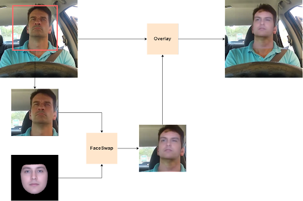

# **RUN 01: FaceSwap**

## ***Method***

<p align="center"> </p>

## ***Setup***: 
- Clone the repo: 
```
git clone https://github.com/kaylode/mediaeval21-drsf
cd mediaeval21-drsf && git checkout face-swap
cd face-swap
```
- Install dependencies (you can use conda env if you want): 
```
pip install -r requirements.txt
```

- Download checkpoint (if the command below does not work, please download `vox-first-order.pth.tar` from [here](https://drive.google.com/drive/folders/1SsBifjoM_qO0iFzb8wLlsz_4qW2j8dZe) and put it into `./checkpoints` folder):
```
mkdir checkpoints
cd checkpoints
gdown https://drive.google.com/uc?id=1n2CqYEjM82X7sE40xrZpmnOxF6NekYW0
```
- Create save directory:
```
mkdir demo
mkdir demo/save_swap
```

## ***Usage***
- Run face swap
```
python face_swap.py --source_image "path_to_source_image" \
                    --target_video "path_to_target_video" 
```

- The face swap result:
  - The synthesis video will be saved at `demo/save_swap/result.mp4`
  - The comparison video will be saved at `demo/save_swap/output.mp4`
  - The synthesis video with audio will be saved at `demo/save_swap/ad-result.mp4`
  - The comparison video with audio will be saved at `demo/save_swap/ad-output.mp4`

Example colab notebook full pipeline: https://colab.research.google.com/drive/1t2HPKv0qEBpzW4H9xtFIn5nJnxcdNQ0i?usp=sharing

## **Code References**
- This repo was modified from: https://github.com/AliaksandrSiarohin/motion-cosegmentation

## **Paper References**

```
@misc{siarohin2020motionsupervised,
      title={Motion-supervised Co-Part Segmentation}, 
      author={Aliaksandr Siarohin and Subhankar Roy and Stéphane Lathuilière and Sergey Tulyakov and Elisa Ricci and Nicu Sebe},
      year={2020},
      eprint={2004.03234},
      archivePrefix={arXiv},
      primaryClass={cs.CV}
}
```